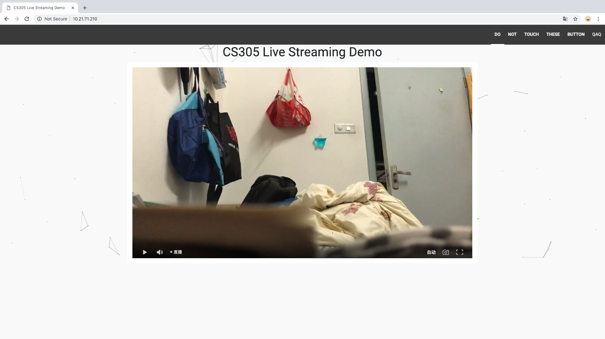

# Live Srteaming Website using DASH

## Contributors: 

- 11712510 Li Haonan : server config
- 11611611 Zheng Bowen: front-end
- 11611606 Chen Peiming: document

## Architecture


Our architecture is similar to the example:

1. Using multiple clients pushing rtmp stream (OBS, DJI GO) to `rtmp://serverip/ingest/mystream`
2. The server will get the stream, and at the same time, server will convert input streams to multiple resolutions by using `ffmpeg`
3. And then the server will get `MPD-DASH` file with different resolutions via different stream passing by `nginx`
4. Finally, the server will support a http service: a perfect video site that can be adjusted based on network conditions or manually 

## Configure Steps

### Download, Build and Install

```bash
 cd ~
 sudo mkdir nginx
 cd nginx
```

### Build Utilities

```bash
 sudo apt-get install git gcc make libpcre3-dev libssl-dev
```

### Download nginx-rtmp

```bash
sudo git clone https://github.com/hguandl/nginx-rtmp-module
```

### Download &unpack nginx

```bash
sudo wget http://nginx.org/download/nginx-1.14.2.tar.gz
sudo tar xzf nginx-1.14.2.tar.gz
cd nginx-1.14.2
```

### Build nginx with nginx-rtmp

```bash
sudo ./configure --with-http_ssl_module --add-module=../nginx-rtmp-module
```

Note: for macOS user, please refer `http://hanoian.com/content/index.php/23-compile-nginx-with-openssl-on-mac-os-x-64-bit`

### Install 

```bash
sudo make
sudo make install
```

### Start nginx server

```bash
cd /usr/local/nginx/sbin
sudo ./nginx
```

### Restart nginx 

```bash
cd /usr/local/nginx/sbin
sudo ./nginx -s stop
sudo ./nginx
```

### Install FFmpeg

```bash
sudo apt-get install ffmpeg
```

### Finally

1. Overwrite `/usr/local/nginx/conf` with this content following:

   ```bash
   worker_processes  1;
   events {
       worker_connections  1024;
   }
   
     rtmp {
       server {
       listen 1935;
      
       application ingest {
         live on;
         dash on;
         dash_path /tmp/dash/raw;
         exec /usr/bin/ffmpeg -i rtmp://localhost/$app/$name -c:a copy -c:v libx264 -preset fast -profile:v baseline -vsync cfr -s 1024x576 -b:v 1024K -bufsize 1024k -f flv rtmp://localhost/dash/$name_hi -c:a copy -c:v libx264 -preset fast -profile:v baseline -vsync cfr -s 640x360 -b:v 832K -bufsize 832k -f flv rtmp://localhost/dash/$name_med -c:a copy -c:v libx264 -preset fast -profile:v baseline -vsync cfr -s 320x180 -b:v 256K -bufsize 256k -f flv rtmp://localhost/dash/$name_low;
       }
         
       application dash {
         live on;
         dash on;
         dash_nested on; 
         dash_repetition on;
         dash_path /tmp/dash;
         dash_fragment 4; # 4 second is generaly a good choice for live
         dash_playlist_length 120; # keep 120s of tail
         dash_cleanup on;
         dash_variant _low bandwidth="256000" width="320" height="180";
         dash_variant _med bandwidth="832000" width="640" height="360";
         dash_variant _hi bandwidth="1024000" width="1024" height="576" max;
       }
     }
     
   }
   http {
   
       include       mime.types;
       default_type  application/octet-stream;
       sendfile        on;
       keepalive_timeout  65;
       
       server {
           listen       80;
           server_name  localhost;
   
           location /dash {
               root   /tmp;
               index  index.html index.htm;
               add_header Cache-Control no-cache;
               add_header 'Access-Control-Allow-Origin' '*';
           }
           error_page   500 502 503 504  /50x.html;
           location = /50x.html {
               root   html;
           }
       }
   }
   ```

2. Overwrite `/usr/local/nginx/html/index.html` with `index.html` in the attachment

## Implementation

In general, it is quite easy to implement. More spcificcally, it can be divided into two steps depending on the config file:

### 1. rtmp server

Nginx will server two rtmp application: `ingest` for the rtmp stream being pushed by clients, `dash` for the  three streams convert by ffmpeg (this conversion step has been embedded as command line code in `ingest` with keyword `exec`). 

In each application, since keyword `dash_path` is enable, so nginx will convert each rtmp stream to `MDP-DASH` file and save in the appropriate directiory.

### 2. http server

This part is generated while installing, and we have just modifiled the `location` file, which helped the browser find this `MPD-DASH` File

And in the front-end, in order to achieve multi-resolution video playback, we use `Dplayer`.

### 3. Front end

Import `dash.js` and `dplayer.js` to receive the dash streaming from the server. `dplaye.js` provide the top encapsulation of `dash.js` 

the main code is to create a player and configurate it

```js
const dp = new DPlayer({
        container: document.getElementById('dplayer'),
        live: true,
        screenshot: true,
        video: {
            quality: [{
                name: '流畅',
                url: '/dash/mystream_low/index.mpd',
                type: 'dash'
            }, {
                name: '标清',
                url: '/dash/mystream_med/index.mpd',
                type: 'dash'
            }, {
                name: '高清',
                url: '/dash/mystream_hi/index.mpd',
                type: 'dash'
            }, {
                name: '原画',
                url: '/dash/raw/mystream.mpd',
                type: 'dash'
            }, {
                name: '自动',
                url: '/dash/mystream.mpd',
                type: 'dash'
            }],
            defaultQuality: 3
        }
    });
```

By using the quality list, video quality can be selected manually. And if it's selected to **自动**，player will automatically select a stream that suits the current network condition by reading the metadata in `/dash/mystream.mpd` 



For convenience, all javascript files are import by CDN or written in the html files.


## References

1. https://github.com/hguandl/nginx-rtmp-module
2. https://github.com/arut/nginx-rtmp-module/wiki/Installing-via-Build 
3. https://github.com/Dash-Industry-Forum/dash.js 

4. https://github.com/MoePlayer/DPlayer
